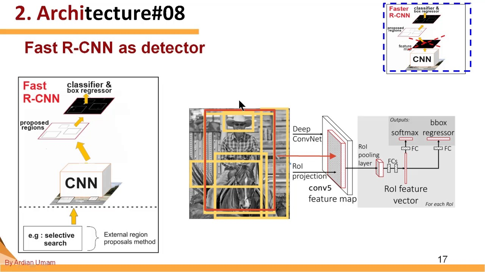

# Food-ingredients-segmentation-and-classification
# Food Ingredients Segmentation and Classification
## Introduction
### CNN in Computer Vision
###### What is Computer Vision?
Computer Vision is an interdisciplinary field of science that aims to make computers process, analyze images and videos and extract details in the same way a human mind does. Earlier Computer Vision was meant only to mimic human visual systems until we realized how AI can augment its applications and vice versa. We may also not realize this every day but we are being assisted by the applications of Computer Vision in automotive, retail, banking and financial services, healthcare, etc.

## Project Description
In this Notebook, we will first do an analysis of the Food Recognition Dataset and then use maskrcnn for training on the dataset.
Given Images of Food, we are asked to provide Instance Segmentation over the images for the food items.
We present a CNN-based dish detection and score estimation system, running on iOS or android. The proposed app can estimate the score after detecting dishes from the video stream captured from the built-in camera of a Phone. For the deep learning framework, we use Keras (backend TensorFlow) to train and convert the model for CoreML to use it.
#### Project problem
* Can we segment, and classify what type of food is in an image?
* Multiclass,multi-instance problem
* Practical use case for tracking food intake
###### Using and Implementing Mask R-CNN for Image Segmentation (with Python Code) ?
Mask R-CNN is basically an extension of Faster R-CNN. Faster R-CNN is widely used for object detection tasks. For a given image, it returns the class label and bounding box coordinates for each object in the image.
</br> 
###### How CNNs Work?
Most of the Computer Vision tasks are surrounded around CNN architectures, as the basis of most of the problems is to classify an image into known labels. Algorithms for object detection like SSD(single shot multi-box detection) and YOLO(You Only Look Once) are also built around CNN.
</br> 
###### What is Tensorflow?
TensorFlow is a free and open-source software library for dataflow and differentiable programming across a range of tasks. It is a symbolic math library, and is also used for machine learning applications such as neural networks.

###### what is Keras?
Keras is an open-source neural-network library written in Python. It is capable of running on top of TensorFlow, Microsoft Cognitive Toolkit, R, Theano, or PlaidML. Designed to enable fast experimentation with deep neural networks.

</br> 
## Dataset
We used COCO image dataset found in  <a href="https://cocodataset.org/#home"> COCO Food Dataset</a></br> which contains regular images of food not that you found on Tv or on menus it looks like more of what you get on your plate
###### What is CoCo Dataset?
The Common Objects in Context (COCO) dataset is one of the most popular open source object recognition databases used to train deep learning programs. This database includes hundreds of thousands of images with millions of already labeled objects for training.</br>

Arguably the most important element of supervised machine learning is access to a large and well documented dataset to learn from. Sponsored by Microsoft, COCO segments images into categories and object, while also providing machine-readable context captions and tags. This all drastically cuts down on the basic training time for any AI that needs to process images. </br>
* There are 3 splits in this dataset we used :</br>
  The Training Data is provided in the COCO format, making it simpler to load with pre-available COCO data processors in popular libraries.
  train.tar.gz : This is the Training Set of 5545 (as RGB images) food images, along with their corresponding annotations in MS-COCO format</br>
  The test set provided in the public dataset is similar to Validation set, but with no annotations. 
  val.tar.gz: This is the suggested Validation Set of 291 (as RGB images) food images, along with their corresponding annotations in MS-COCO format</br>
  The test set after submission is much larger and contains private images upon which every submission is evaluated.
  test_images.tar.gz : This is the debug Test Set for Round-1, where you are provided the same images as the validation set.</br>
 * Each split contains 40 categories of food. </br>

## Approach
We built a system recently for the purpose of experimenting with Deep Learning. The key components are a single NVIDIA Tesla K80 GPU w/12 GB of memory that can be used up to 12 hours continuously offered by Google Colab,25 gb of system RAM.It is running 64-bit Ubuntu 19.04 and using the jupyter notebook Python 3.6 distribution.

## Results
After fine-tuning a pre-trained ResNet152V2 model, to extract the features with the Unet architecture  I was able to achieve about 77% Top-1 Accuracy on the test set using a single crop per item.But when it came to prediction there is a noticed loss.
Ultimately, it gave the most consistent results, and when spot checking predictions it also visually appeared the most consistent
</br> 
* We have been able to achieve more accurate results with: </br>
  InceptionV3 </br>
  ResNet200 </br>
  WISeR </br>
  
 * And less accurate results with: </br>
  DenseNet201 </br>
  MobileNetV2 </br>


## Thoughts and future improvement
We have spent about 2 months on and off building this project, trying to train dozens of models and exploring various areas such as multiprocessing for faster image augmentation. This is a cleaned up version of the notebook that contains my best performing model as of Sep 14, 2020.</br>
If you have more ressources (in term of ram and GPU) you can replace the dataset with another one which is richer(like FOOD-101 for example) and other different models to get better results. </br>
In the future, We would like to learn how to: </br>

* How to handle larger than RAM datasets in a performant way?
* How to avoid Loading a large amount of data into memory?
* Saving the data into h5py file for out of band processing?
* Improving multiprocessing image augmentation? </br>
Please get in touch if you have any ideas! </br>
## Ressources:
I was inspired by this blog post for Image segmentation: <a href="https://www.analyticsvidhya.com/blog/2019/07/computer-vision-implementing-mask-r-cnn-image-segmentation/" >implementing mask r-cnn image segmentation </a></br>
and a related script I found on github that belongs to Keras too: <a href="https://keras.io/guides/transfer_learning/">keras-finetuning</a></br>
## Experiment
Since you can not see the results in the jupyter notebook due to its size unless you download it and open it with either anaconda or colab i will put some results below : </br>
### Importing Libraries </br>
We import keras, tensorflow_examples, and tensorflow for the deep learning process, google.colab to access files, matplotlib to plot files, numpy for computation and os for checking for files. Additionally, since the annotations are in the coco format, we install coco library to read and access the files.</br>
```bash
#installing coco library
!pip install git+https://github.com/AIcrowd/coco.git#subdirectory=PythonAPI
```
```bash
#installing library for pix2pix
!pip install git+https://github.com/tensorflow/examples
```
```bash
%tensorflow_version 2.x
import tensorflow as tf
```
```bash
#model fitting
from keras import backend as K
from tensorflow_examples.models.pix2pix import pix2pix

#accessing data on drive
from google.colab import drive

#plotting
import matplotlib.image as mpimg
import matplotlib.pyplot as plt

#computation
import numpy as np

#reading and accessing coco formatted data
from pycocotools.coco import COCO
from pycocotools import mask as cocomask

#file checking
import os

#mounting drive
drive.mount('/content/drive')
```
#### Loading in Data </br>
Here we use the coco libaries to read the jsons and access the files.
```python
#Loading the coco annotations
ADLFolderLocation = '/content/drive/My Drive/ADLFinalProject/'

#note validation and training set are nearly the same - will combine and split later
coco = COCO(ADLFolderLocation + 'annotations_train.json')
coco_val = COCO(ADLFolderLocation + 'annotations_val.json')
```
#### Exploring the data
To explore the data we plot training images and their associated segmentations. </br>
```python
#given an image_id, plot the image and mask
def plot_image(image_id):

  #reading image
  img = mpimg.imread(ADLFolderLocation  + 'train_images/' + 
                        (6 - len(str(image_id))) * str(0) +
                             str(image_id) + '.jpg')
  
  #displayin image
  imgplot = plt.imshow(img)

  #loading image id
  anns_ids = coco.getAnnIds(imgIds = image_id)
  anns = coco.loadAnns(anns_ids)
  
  #iterating through annotations
  for i in range(len(anns)):

    #picking a different color for each annotation
    col = ['b', 'g', 'r', 'c', 'm', 'y', 'k'][i]

    ann = anns[i]

    #plotting the segmentation
    for seg in ann['segmentation']:
        plt.fill(seg[0::2],
               seg[1::2], col, alpha = 0.4)
        
  #showing the results
  plt.show()
```

```
#plotting a few random images
np.random.seed(100)
rand_image_nums = np.random.randint(0, len(coco.getImgIds()), 5)

for rand_num in rand_image_nums:

  plot_image(coco.getImgIds()[rand_num])
```
#### Loading and Cleaning Data
Before the model fitting process, we use the coco library and tensorflow image reading functions to read in the images, read in their associated segmentations and save them to a tensor.
</br>
First, we get the categorical ids and put them in a list ordered by commonality of category. The class will be the index of the categorical id in this list. The order places the most common food class at 41, while the least common at 1. The 0 class which represents no food remains the most common class overall.
```
#getting categories
cat_ids_raw = coco.getCatIds()

#creating blank list to add categories to
cat_ids = []

#iterating through and adding number of images per category and category to list
for cat in cat_ids_raw:
  cat_ids.append([len(coco.getImgIds(catIds = cat)), cat])


#sorting by number of images per category
cat_ids.sort()

#extracting categorical number for each id
cat_ids = [cat_num[1] for cat_num in cat_ids]
```
Next we load all the "training" and "validation" images. Since they appear to be arbitrarily assigned, we load them both and randomly reassign training / validation status.
```
#checking if files for x and y already exist
train_data_not_saved = not (os.path.exists(ADLFolderLocation + "x_3.npy") and os.path.exists(ADLFolderLocation + "y_3.npy"))
val_data_not_saved = not (os.path.exists(ADLFolderLocation + "x_val.npy") and os.path.exists(ADLFolderLocation + "y_val.npy"))


#size that images are resized to
image_size = 256

#determining number of classes / images
num_classes = len(cat_ids) + 1
num_images = len(coco.getImgIds())
num_images_val = len(coco_val.getImgIds())

#only running if the data needs to be saved
if train_data_not_saved:


  #creating blank X and Y length of number of observations
  X = np.zeros((num_images, image_size, image_size, 3))
  Y = np.zeros((num_images, image_size, image_size, 1))

  #iterating through "train" images
  for i in range(num_images):

    #printing how far in iteration
    print(str(i+1) + ' / ' + str(num_images))

    #image is current image
    image = coco.getImgIds()[i]

    #getting annotations
    anns_ids = coco.getAnnIds(imgIds= image)
    anns = coco.loadAnns(anns_ids)

    #creating matrix of zeros to store annotations. Zero represents no food class
    anns_img = np.zeros((coco.imgs[image]['height'] ,
                     coco.imgs[image]['width'],
                     1))
    

    #iterating through
    for ann in anns:

        #determining class by index in the cat_ids list
        ann_class = cat_ids.index(ann['category_id']) + 1

        #filling zeros matrix with appropriate class
        #when there is multiclass overlap more common class wins since we sorted above
        anns_img[:,:,0] = np.maximum(anns_img[:,:,0],
                                           coco.annToMask(ann) * ann_class)


    #resizing image
    anns_img = tf.image.resize(anns_img, (image_size, image_size))
    
    #saving image to y
    Y[i] = anns_img

    #image path
    image_path = (ADLFolderLocation + 'train_images/' + 
                        (6 - len(str(image))) * str(0) +
                             str(image) + '.jpg')


    #loading in images and resizing
    img = tf.io.read_file(image_path)
    img = tf.image.decode_jpeg(img, channels=3)
    img = tf.image.resize(img, (image_size, image_size))


    #saving observation and normalizing
    X[i] = img
    X[i] = X[i]/255.0

  #saving results
  np.save(arr = X, file = ADLFolderLocation + 'x_3')

  np.save(arr = Y, file = ADLFolderLocation + 'y_3')    


#only running if the data needs to be saved
if val_data_not_saved:

  #creating blank X and Y length of number of observations
  X_val = np.zeros((num_images_val, image_size, image_size, 3))
  Y_val = np.zeros((num_images_val, image_size, image_size, 1))

  #same process for validation set
  for i in range(num_images_val):

    #printing how far in iteration
    print(str(i+1) + ' / ' + str(num_images_val))

    #image is current image
    image = coco_val.getImgIds()[i]

    #getting annotations
    anns_ids = coco_val.getAnnIds(imgIds= image)
    anns = coco_val.loadAnns(anns_ids)

    #creating matrix of zeros to store annotations. Zero represents no food class
    anns_img = np.zeros((coco_val.imgs[image]['height'] ,
                      coco_val.imgs[image]['width'],
                      1))
    
    #iterating through
    for ann in anns:

        
        #determining class by index in the cat_ids list
        ann_class = cat_ids.index(ann['category_id']) + 1


        #filling zeros matrix with appropriate class
        #when there is multiclass overlap more common class wins since we sorted above
        anns_img[:,:,0] = np.maximum(anns_img[:,:,0],
                                           coco_val.annToMask(ann) * ann_class)

      

    #resizing image
    anns_img = tf.image.resize(anns_img, (image_size, image_size))

    #saving image to y
    Y_val[i] = anns_img

    #image path
    image_path = (ADLFolderLocation + 'val_images/' + 
                        (6 - len(str(image))) * str(0) +
                             str(image) + '.jpg')


    #loading in images and resizing
    img = tf.io.read_file(image_path)
    img = tf.image.decode_jpeg(img, channels=3)
    img = tf.image.resize(img, (image_size, image_size))

    #saving observation and normalizing
    X_val[i] = img
    X_val[i] = X_val[i]/255.0

  #saving results
  np.save(arr = X_val, file = ADLFolderLocation + 'x_val')

  np.save(arr = Y_val, file = ADLFolderLocation + 'y_val') 
```
#### Building Model Architecture
Here we are training a UNet model. We used this <a href="https://www.tensorflow.org/tutorials/images/segmentation">tensorflow tutorial </a> to create our model architecture.
```
#using mobilenetv2 model to 
resnet = tf.keras.applications.ResNet152V2(input_shape=[image_size, image_size, 3], 
                                                    include_top=False)

# Use the activations of these from mobileNetV2 model
layer_names = [
    'conv1_conv',  
    'conv2_block3_1_relu',  
    'conv3_block8_1_relu', 
    'conv4_block36_1_relu', 
    'post_relu'
]
layers = [resnet.get_layer(name).output for name in layer_names]

# Create the feature extraction model
down_stack = tf.keras.Model(inputs=resnet.input, outputs=layers)

down_stack.trainable = False
```
```
#usied for
up_stack = [
    pix2pix.upsample(512, 3),  # 4x4 -> 8x8
    pix2pix.upsample(256, 3),  # 8x8 -> 16x16
    pix2pix.upsample(128, 3),  # 16x16 -> 32x32
    pix2pix.upsample(64, 3),   # 32x32 -> 64x64
]
```
Here, we create a function for that returns a unet model.
```
#creates a UNet model for the given number of output channels
def unet_model(output_channels):

  # This is the last layer of the model
  last = tf.keras.layers.Conv2DTranspose(
      output_channels, 3, strides=2,
      padding='same', activation='softmax')


  #inputs of model
  inputs = tf.keras.layers.Input(shape=[image_size, image_size, 3])
  x = inputs

  # Downsampling through the model
  skips = down_stack(x)
  x = skips[-1]
  skips = reversed(skips[:-1])

  # Upsampling and establishing the skip connections
  for up, skip in zip(up_stack, skips):
    x = up(x)
    concat = tf.keras.layers.Concatenate()
    x = concat([x, skip])

  x = last(x)

  return tf.keras.Model(inputs=inputs, outputs=x)
```
```
#creating 41 class model
model = unet_model(41)
```
```
#showing architecture
tf.keras.utils.plot_model(model, show_shapes=True)
```
 </br>
#### Creating Weights for Model and Custom Loss Function
Since there are a considerably more pixels of class 0 (no food class) than all the other classes combined, we must reweight all the classes to prevent the model from simply predicting every pixel as class 0. Since there is no way in base tensorflow or keras to weight multiclass models that have more than 3 classes, we must create a custom loss function.
</br>
First we load the mask information and initiate dictionaries to store class counts.
```
#loading y if it does not exist
if not ('Y' in locals()):
  Y = np.load(file = ADLFolderLocation + 'y_3.npy')    

#creating dictionaries to store number of classes and class weights
count_values={}
class_weights = {}

#initializing the counts at 0
j=0
for j in range(num_classes):
  count_values[j] = 0 
```
#### Next, we count the number of pixels for each class.
```
#setting i to 0 to start
i=0

#saving variable for total number of pixels
total_size = 0

#iterating through Y observations
for i in range(len(Y)):

  #iterating through 41 classes
  j = 0
  for j in range(num_classes):
    #counting number of pixels from given class
    count_values[j] = count_values[j] + sum(sum(Y[i] == j))[0]
  
  #increasing total size
  total_size = total_size  + (256*256)


#testing to make sure weights
print('The percent of Y that is 0 class is: '+str(count_values[0]/total_size))
print('The percent of Y that is 1 class is: '+str(count_values[1]/total_size))
print('The percent of Y that is 40 class is: '+str(count_values[40]/total_size))
```
 </br>
```
#iterating through each class
j=0
for j in range(num_classes):
  #class_weights[j] = (1/count_values[j]) * 100000

  if j == 0:
    class_weights[j] = 0.1
  else:
    class_weights[j] = 0.5
```
Finally, we create a custom loss function.
```
#This is an attempt at a custom loss function from:
#https://stackoverflow.com/questions/51793737/custom-loss-function-for-u-net-in-keras-using-class-weights-class-weight-not

def weightedLoss(originalLossFunc, weightsList):

    def lossFunc(true, pred):

        #axis = -1 #if channels last 
        axis=  1 #if channels first


        #argmax returns the index of the element with the greatest value
        #done in the class axis, it returns the class index    
        classSelectors = K.argmax(true, axis=axis) 

        #considering weights are ordered by class, for each class
        #true(1) if the class index is equal to the weight index   
        classSelectors = [K.equal(K.cast(i,'int64'), K.cast(classSelectors,'int64')) for i in range(len(weightsList))]

        #casting boolean to float for calculations  
        #each tensor in the list contains 1 where ground true class is equal to its index 
        #if you sum all these, you will get a tensor full of ones. 
        #x1 = K.cast(x_input, dtype='int32')
        classSelectors = [K.cast(x, K.floatx()) for x in classSelectors]

        #for each of the selections above, multiply their respective weight
        weights = [sel * w for sel,w in zip(classSelectors, weightsList)] 

        #sums all the selections
        #result is a tensor with the respective weight for each element in predictions
        weightMultiplier = weights[0]
        for i in range(1, len(weights)):
            weightMultiplier = weightMultiplier + weights[i]


        #make sure your originalLossFunc only collapses the class axis
        #you need the other axes intact to multiply the weights tensor
        loss = originalLossFunc(true,pred) 
        loss = loss * weightMultiplier

        return loss
    return lossFunc
```

```
weights = class_weights.values()
weights
```
 </br>
#### Training Model
Here, we compile and fit the model.
```
#compiling with custom weight function
model.compile(optimizer='adam', loss=weightedLoss(tf.keras.losses.sparse_categorical_crossentropy,weights),
              #sample_weight_mode='temporal' , loss = 'sparse_categorical_crossentropy',
              metrics=['accuracy'])
```
```
#loading X and Y if needed
if not ('Y' in locals()):
  Y = np.load(file = ADLFolderLocation + 'y_3.npy')    

if not ('X' in locals()):
  X =  np.load(file = ADLFolderLocation + 'x_3.npy')
#try with class weights

#https://datascience.stackexchange.com/questions/13490/how-to-set-class-weights-for-imbalanced-classes-in-keras
#https://stackoverflow.com/questions/51793737/custom-loss-function-for-u-net-in-keras-using-class-weights-class-weight-not

#fitting vlaues
model_history = model.fit(x = X,
                          validation_split = 0.25,
                          y = Y, epochs=10)
```
 </br>
#### Plotting model history:
```
# A plotting function you can reuse
def plot(history):
  
  # The history object contains results on the training and test
  # sets for each epoch
  acc = history.history['accuracy']
  val_acc = history.history['val_accuracy']
  loss = history.history['loss']
  val_loss = history.history['val_loss']

  # Get the number of epochs
  epochs = range(len(acc))

  plt.title('Training and validation accuracy')
  plt.plot(epochs, acc, color='blue', label='Train')
  plt.plot(epochs, val_acc, color='orange', label='Val')
  plt.xlabel('Epoch')
  plt.ylabel('Accuracy')
  plt.legend()

  _ = plt.figure()
  plt.title('Training and validation loss')
  plt.plot(epochs, loss, color='blue', label='Train')
  plt.plot(epochs, val_loss, color='orange', label='Val')
  plt.xlabel('Epoch')
  plt.ylabel('Loss')
  plt.legend()
  
plot(model_history)

```
 </br>
#### Making Predictions
```

def plot_prediction(i, category = None, show = False, return_val = False, show_all_classes = False):
  


  plt.imshow(X[i])
  if show:
    predictions = model.predict(X[i].reshape(1, image_size, image_size, 3))

    predictions = predictions[0]

    plt.imshow(predictions.argmax(axis = 2) == category, alpha = 0.5)

    if show_all_classes == True:
      for j in range(1,41):
        print(coco.cats[cat_ids[j-1]]['name']+ ' : ')
        plt.imshow(X[i])
        plt.imshow(predictions[:,:,j],alpha=0.7)
        plt.show()

    if return_val:

      return predictions
```

```
test_plot = plot_prediction(i = 34, show = True, category = 0, return_val = True)
plot_prediction(i = 34, show = False, category = 1085, return_val = True)


```
 </br>

```
plot_prediction(i = 34, show = True, category = 1085, return_val = False,show_all_classes = True)

```
 </br>


```
import pandas as pd
pd.DataFrame(pred.argmax(axis = 2)).to_csv('test.csv')
plot_prediction(i = 30, show = False, category = 0)
```
 </br>
```
plot_prediction(i = 30, show = True, category = 0, show_all_classes=True)
```
`
 </br>
`
 </br>
```

```
