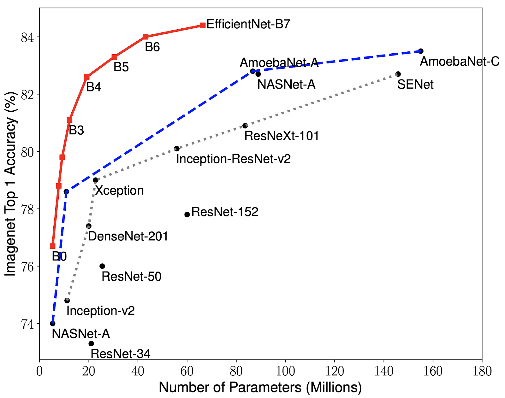

# Food-ingredients-segmentation-and-classification
# Food Ingredients Segmentation and Classification
## Introduction
### CNN in Computer Vision
###### What is Computer Vision?
Computer Vision is an interdisciplinary field of science that aims to make computers process, analyze images and videos and extract details in the same way a human mind does. Earlier Computer Vision was meant only to mimic human visual systems until we realized how AI can augment its applications and vice versa. We may also not realize this every day but we are being assisted by the applications of Computer Vision in automotive, retail, banking and financial services, healthcare, etc.

## Project Description
In this Notebook, we will first do an analysis of the Food Recognition Dataset and then use maskrcnn for training on the dataset.
Given Images of Food, we are asked to provide Instance Segmentation over the images for the food items.
We present a CNN-based dish detection and score estimation system, running on iOS or android. The proposed app can estimate the score after detecting dishes from the video stream captured from the built-in camera of a Phone. For the deep learning framework, we use Keras (backend TensorFlow) to train and convert the model for CoreML to use it.
#### Project problem
* Can we segment, and classify what type of food is in an image?
* Multiclass,multi-instance problem
* Practical use case for tracking food intake
###### Using and Implementing Mask R-CNN for Image Segmentation (with Python Code) ?
Mask R-CNN is basically an extension of Faster R-CNN. Faster R-CNN is widely used for object detection tasks. For a given image, it returns the class label and bounding box coordinates for each object in the image.
  
###### How CNNs Work?
Most of the Computer Vision tasks are surrounded around CNN architectures, as the basis of most of the problems is to classify an image into known labels. Algorithms for object detection like SSD(single shot multi-box detection) and YOLO(You Only Look Once) are also built around CNN.
  
###### What is Tensorflow?
TensorFlow is a free and open-source software library for dataflow and differentiable programming across a range of tasks. It is a symbolic math library, and is also used for machine learning applications such as neural networks.

###### what is Keras?
Keras is an open-source neural-network library written in Python. It is capable of running on top of TensorFlow, Microsoft Cognitive Toolkit, R, Theano, or PlaidML. Designed to enable fast experimentation with deep neural networks.

  
## Dataset
We used COCO image dataset found in  <a href="https://cocodataset.org/#home"> COCO Food Dataset</a>  which contains regular images of food not that you found on Tv or on menus it looks like more of what you get on your plate
###### What is CoCo Dataset?
The Common Objects in Context (COCO) dataset is one of the most popular open source object recognition databases used to train deep learning programs. This database includes hundreds of thousands of images with millions of already labeled objects for training. 

Arguably the most important element of supervised machine learning is access to a large and well documented dataset to learn from. Sponsored by Microsoft, COCO segments images into categories and object, while also providing machine-readable context captions and tags. This all drastically cuts down on the basic training time for any AI that needs to process images.  
* There are 3 splits in this dataset we used : 
  The Training Data is provided in the COCO format, making it simpler to load with pre-available COCO data processors in popular libraries.
  train.tar.gz : This is the Training Set of 5545 (as RGB images) food images, along with their corresponding annotations in MS-COCO format 
  The test set provided in the public dataset is similar to Validation set, but with no annotations. 
  val.tar.gz: This is the suggested Validation Set of 291 (as RGB images) food images, along with their corresponding annotations in MS-COCO format 
  The test set after submission is much larger and contains private images upon which every submission is evaluated.
  test_images.tar.gz : This is the debug Test Set for Round-1, where you are provided the same images as the validation set. 
 * Each split contains 40 categories of food.  

## Approach
We built a system recently for the purpose of experimenting with Deep Learning. The key components are a single NVIDIA Tesla K80 GPU w/12 GB of memory that can be used up to 12 hours continuously offered by Google Colab,25 gb of system RAM.It is running 64-bit Ubuntu 19.04 and using the jupyter notebook Python 3.6 distribution.

## Results
After fine-tuning a pre-trained ResNet152V2 model, to extract the features with the Unet architecture  I was able to achieve about 77% Top-1 Accuracy on the test set using a single crop per item.But when it came to prediction there is a noticed loss.
Ultimately, it gave the most consistent results, and when spot checking predictions it also visually appeared the most consistent
  
* We have been able to achieve more accurate results with:  
  InceptionV3  
  ResNet200  
  WISeR  
  
 * And less accurate results with:  
  DenseNet201  
  MobileNetV2  

## Thoughts and future improvement
We have spent about 2 months on and off building this project, trying to train dozens of models and exploring various areas such as multiprocessing for faster image augmentation. This is a cleaned up version of the notebook that contains my best performing model as of Sep 14, 2020. 
If you have more ressources (in term of ram and GPU) you can replace the dataset with another one which is richer(like FOOD-101 for example) and other different models to get better results.  
In the future, We would like to learn how to:  

* How to handle larger than RAM datasets in a performant way?
* How to avoid Loading a large amount of data into memory?
* Saving the data into h5py file for out of band processing?
* Improving multiprocessing image augmentation?  
Please get in touch if you have any ideas!  
## Ressources:
I was inspired by this blog post for Image segmentation: <a href="https://www.analyticsvidhya.com/blog/2019/07/computer-vision-implementing-mask-r-cnn-image-segmentation/" >implementing mask r-cnn image segmentation </a> 
and a related script I found on github that belongs to Keras too: <a href="https://keras.io/guides/transfer_learning/">keras-finetuning</a> 
## Experiment
Since you can not see the results in the jupyter notebook due to its size unless you download it and open it with either anaconda or colab i will put some results below :
